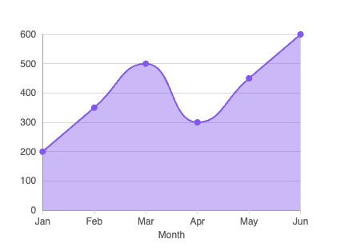
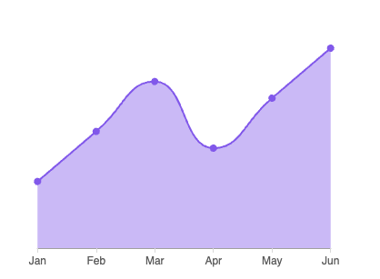
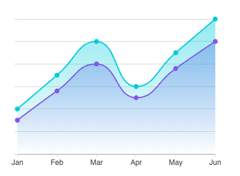

# @wavemaker/react-native-echarts

[](https://www.npmjs.com/package/@wavemaker/react-native-echarts)
[](https://github.com/wavemaker/wm-react-native-echarts/blob/main/LICENSE)

[](https://www.npmjs.com/package/@wavemaker/react-native-echarts)
[](https://github.com/wavemaker/wm-react-native-echarts)
[](https://wavemaker.github.io/wm-react-native-echarts)

React Native chart components built with ECharts (via `@wuba/react-native-echarts`) and Skia. Works with Expo and bare React Native. Visit storybook at https://wavemaker.github.io/wm-react-native-echarts for more details on how to use and examples.

## Installation

Install the package from npm:

```bash
npm install @wavemaker/react-native-echarts
```

The library declares peer dependencies. Add any your app does not already include (align versions with your React Native or Expo SDK):

```bash
npm install @shopify/react-native-skia @wuba/react-native-echarts echarts zrender react-native-svg
```

`react` and `react-native` are also peers; they should already be present in your app.

## Chart gallery

Preview thumbnails for the chart examples in `assets/images/charts`. Each image uses the same width and height (200×200) so the layout stays even; `object-fit: contain` keeps aspect ratios readable.

### Area

<table>
  <tbody>
    <tr>
      <td align="center"><br /><sub>chart1</sub></td>
      <td align="center"><br /><sub>chart2</sub></td>
      <td align="center"><br /><sub>chart3</sub></td>
    </tr>
  </tbody>
</table>

### Bar

<table>
  <tbody>
    <tr>
      <td align="center"><br /><sub>horizontal-bar</sub></td>
      <td align="center"><br /><sub>labeled-bar</sub></td>
      <td align="center"><br /><sub>mixed-bar</sub></td>
    </tr>
  </tbody>
</table>

### Bubble

<table>
  <tbody>
    <tr>
      <td align="center"><br /><sub>default</sub></td>
      <td align="center"><br /><sub>multi-bubble</sub></td>
      <td align="center"><br /><sub>pin-bublbe</sub></td>
    </tr>
  </tbody>
</table>

### Candlestick

<table>
  <tbody>
    <tr>
      <td align="center"><br /><sub>default</sub></td>
      <td align="center"><br /><sub>with-ma</sub></td>
      <td align="center"><br /><sub>with-volume</sub></td>
    </tr>
  </tbody>
</table>

### Column

<table>
  <tbody>
    <tr>
      <td align="center"><br /><sub>active-column</sub></td>
      <td align="center"><br /><sub>multi-series</sub></td>
      <td align="center"><br /><sub>standard</sub></td>
    </tr>
  </tbody>
</table>

### Geo

<table>
  <tbody>
    <tr>
      <td align="center"><br /><sub>colors</sub></td>
      <td align="center"><br /><sub>default</sub></td>
      <td align="center"><br /><sub>us-map</sub></td>
    </tr>
  </tbody>
</table>

### Gauge

<table>
  <tbody>
    <tr>
      <td align="center"><br /><sub>digital</sub></td>
      <td align="center"><br /><sub>radial</sub></td>
      <td align="center"><br /><sub>simple</sub></td>
    </tr>
  </tbody>
</table>

### Line

<table>
  <tbody>
    <tr>
      <td align="center"><br /><sub>multi-line</sub></td>
      <td align="center"><br /><sub>standard-line</sub></td>
      <td align="center"><br /><sub>trend-line</sub></td>
    </tr>
  </tbody>
</table>

### Pie

<table>
  <tbody>
    <tr>
      <td align="center"><br /><sub>concentric</sub></td>
      <td align="center"><br /><sub>donut</sub></td>
      <td align="center"><br /><sub>pie</sub></td>
    </tr>
  </tbody>
</table>

### Radar

<table>
  <tbody>
    <tr>
      <td align="center"><br /><sub>default</sub></td>
      <td align="center"><br /><sub>multiple</sub></td>
      <td align="center"><br /><sub>with-symbol</sub></td>
    </tr>
  </tbody>
</table>

### Radial

<table>
  <tbody>
    <tr>
      <td align="center"><br /><sub>custom-colors</sub></td>
      <td align="center"><br /><sub>default</sub></td>
      <td align="center"><br /><sub>with-bg</sub></td>
    </tr>
  </tbody>
</table>

### Scatter

<table>
  <tbody>
    <tr>
      <td align="center"><br /><sub>default</sub></td>
      <td align="center"><br /><sub>multi</sub></td>
      <td align="center"><br /><sub>with-symbol</sub></td>
    </tr>
  </tbody>
</table>

---

## Building the library (maintainers)

Compile components and prepare the npm package:

```bash
npm run build:lib      # TypeScript compile → dist/npm-packages/charts
npm run prepare:npm    # Write package.json, copy README, .npmignore
cd dist/npm-packages/charts && npm publish
```

---

## Development

This repo is an Expo app. To run the app and Storybook:

```bash
npm install
npx expo start # for mobile preview
npm run storybook # to checout the component stories 
```

---

## Maintainers

This package is maintained by [WaveMaker](https://www.wavemaker.com/). The source repository is [wavemaker/wm-react-native-echarts](https://github.com/wavemaker/wm-react-native-echarts). Use [GitHub Issues](https://github.com/wavemaker/wm-react-native-echarts/issues) for bug reports and feature requests.

---

## License

MIT
