# @wavemaker/react-native-echarts

[](https://www.npmjs.com/package/@wavemaker/react-native-echarts)
[](https://github.com/wavemaker/wm-react-native-echarts/blob/main/LICENSE)

[](https://www.npmjs.com/package/@wavemaker/react-native-echarts)
[](https://github.com/wavemaker/wm-react-native-echarts)
[](https://wavemaker.github.io/wm-react-native-echarts)

React Native chart components built with ECharts (via `@wuba/react-native-echarts`) and Skia. Works with Expo and bare React Native. Visit storybook at https://wavemaker.github.io/wm-react-native-echarts for more details on how to use and examples.

## Installation

Install the package from npm:

```bash
npm install @wavemaker/react-native-echarts
```

The library declares peer dependencies. Add any your app does not already include (align versions with your React Native or Expo SDK):

```bash
npm install @shopify/react-native-skia @wuba/react-native-echarts echarts zrender react-native-svg
```

`react` and `react-native` are also peers; they should already be present in your app.

**Note**:
There is an issue with echarts library. Due to which compilation fails with an error. Here is the link to the issue.
https://github.com/apache/echarts/pull/20485

Till the issue is fixed, follow the workaround mentioned in the below link.
https://github.com/wuba/react-native-echarts/issues/239#issuecomment-2899678660

## Chart gallery

Preview thumbnails for the chart examples in `assets/images/charts`. Each image uses the same width and height (200×200) so the layout stays even; `object-fit: contain` keeps aspect ratios readable.

### Area

<table>
  <tbody>
    <tr>
      <td align="center">
        <a href="https://wavemaker.github.io/wm-react-native-echarts/?path=/story/examples-area--axes-area" target="_blank">
          
          <br />
          <sub>Default</sub>
        </a>
      </td>
      <td align="center">
        <a href="https://wavemaker.github.io/wm-react-native-echarts/?path=/story/examples-area--area-without-axes" target="_blank">
          <br /><sub>Witout axes</sub>
        </a>
      </td>
      <td align="center">
        <a href="https://wavemaker.github.io/wm-react-native-echarts/?path=/story/examples-area--gradient-area" target="_blank">
          <br /><sub>With Gradient Bg</sub>
        </a>
      </td>
    </tr>
  </tbody>
</table>

### Bar

<table>
  <tbody>
    <tr>
      <td align="center">
        <a href="https://wavemaker.github.io/wm-react-native-echarts/?path=/story/examples-bar--horizontal-bar" target="_blank">
          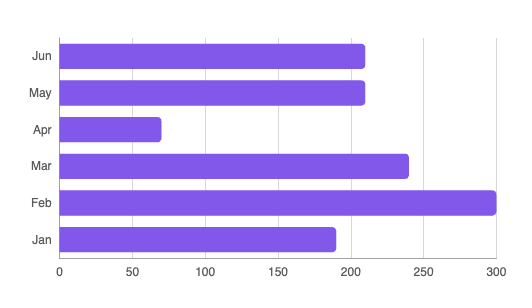<br /><sub>horizontal-bar</sub>
        </a>
      </td>
      <td align="center">
        <a href="https://wavemaker.github.io/wm-react-native-echarts/?path=/story/examples-bar--custom-label-bar">
          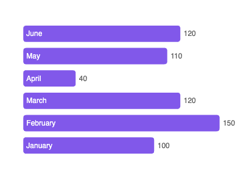<br /><sub>labeled-bar</sub>
        </a>
      </td>
      <td align="center">
        <a href="https://wavemaker.github.io/wm-react-native-echarts/?path=/story/examples-bar--mixed-bar" target="_blank">
          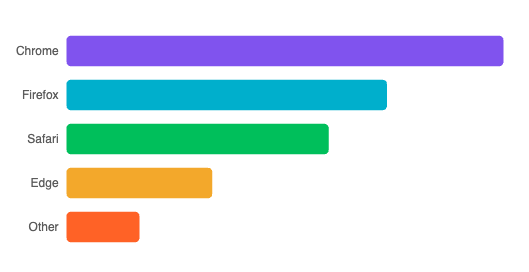<br /><sub>mixed-bar</sub>
        </a>
      </td>
    </tr>
  </tbody>
</table>

### Bubble

<table>
  <tbody>
    <tr>
      <td align="center">
        <a href="https://wavemaker.github.io/wm-react-native-echarts/?path=/story/charts-bubble--default" target="_blank">
          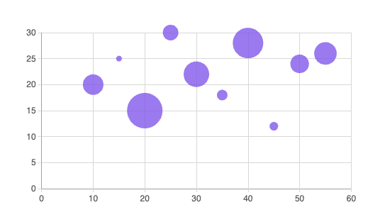<br /><sub>default</sub>
        </a>
      </td>
      <td align="center">
        <a href="https://wavemaker.github.io/wm-react-native-echarts/?path=/story/charts-bubble--show-legend">
          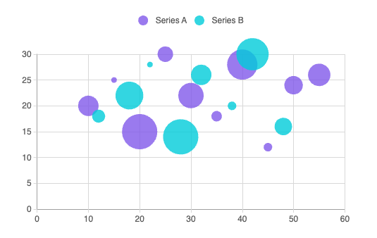<br /><sub>multi-bubble</sub>
        </a>
      </td>
      <td align="center">
        <a href="https://wavemaker.github.io/wm-react-native-echarts/?path=/story/charts-bubble-symbol--pin" target="_blank">
          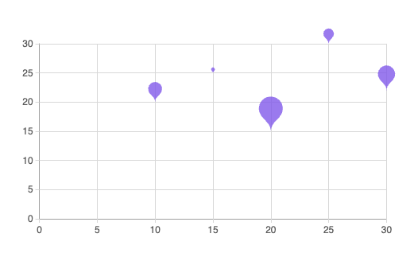<br /><sub>pin-bublbe</sub>
        </a>
      </td>
    </tr>
  </tbody>
</table>

### Candlestick

<table>
  <tbody>
    <tr>
      <td align="center">
        <a href="https://wavemaker.github.io/wm-react-native-echarts/?path=/story/charts-candlestick--default" target="_blank">
          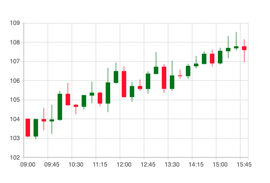<br /><sub>default</sub>
        </a>
      </td>
      <td align="center">
        <a href="https://wavemaker.github.io/wm-react-native-echarts/?path=/story/charts-candlestick--with-moving-average" target="_blank">
          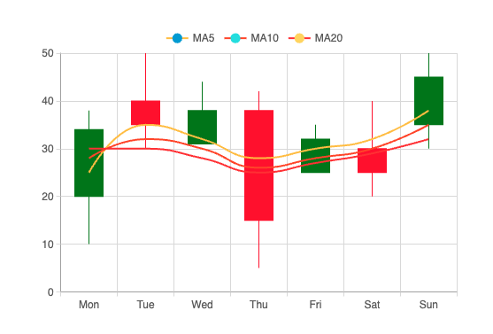<br /><sub>with-ma</sub>
        </a>
      </td>
      <td align="center">
        <a href="https://wavemaker.github.io/wm-react-native-echarts/?path=/story/charts-candlestick--with-volume">
          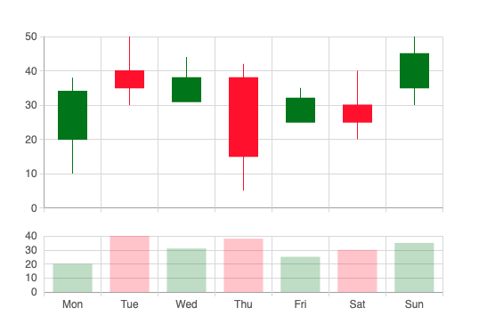<br /><sub>with-volume</sub>
        </a>
      </td>
    </tr>
  </tbody>
</table>

### Column

<table>
  <tbody>
    <tr>
      <td align="center">
        <a href="https://wavemaker.github.io/wm-react-native-echarts/?path=/story/examples-column--active-column">
          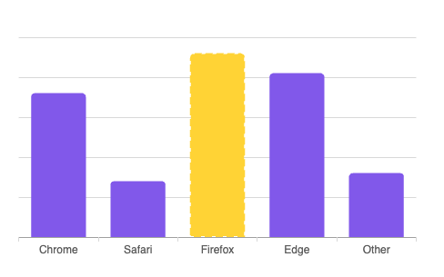<br /><sub>active-column</sub>
        </a>
      </td>
      <td align="center">
        <a href="https://wavemaker.github.io/wm-react-native-echarts/?path=/story/examples-column--multiple-series">
          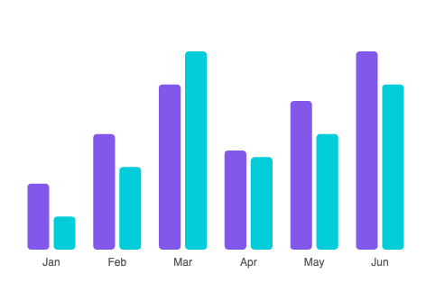<br /><sub>multi-series</sub>
        </a>
      </td>
      <td align="center">
        <a href="https://wavemaker.github.io/wm-react-native-echarts/?path=/story/examples-column--standard-column">
          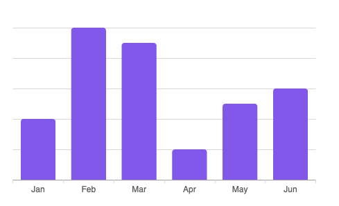<br /><sub>standard</sub>
        </a>
      </td>
    </tr>
  </tbody>
</table>

### Geo

<table>
  <tbody>
    <tr>
      <td align="center">
        <a href="https://wavemaker.github.io/wm-react-native-echarts/?path=/story/charts-geo-colors--custom-colors" target="_blank">
          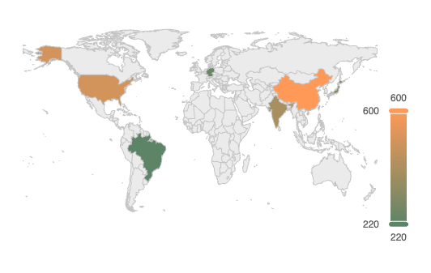<br /><sub>colors</sub>
        </a>
      </td>
      <td align="center">
        <a href="https://wavemaker.github.io/wm-react-native-echarts/?path=/story/charts-geo--default" target="_blank">
          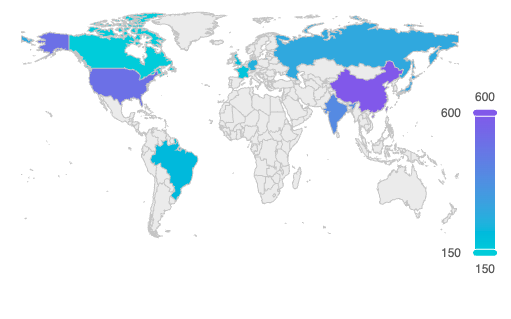<br /><sub>default</sub>
        </a>
      </td>
      <td align="center">
        <a href="https://wavemaker.github.io/wm-react-native-echarts/?path=/story/charts-geo-map--presidential-results" target="_blank">
          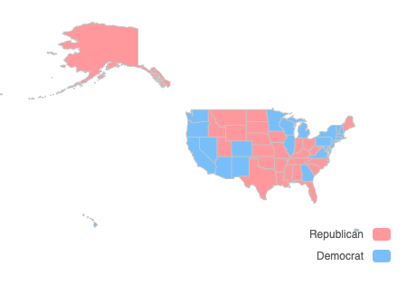<br /><sub>us-map</sub>
        </a>
      </td>
    </tr>
  </tbody>
</table>

### Gauge

<table>
  <tbody>
    <tr>
      <td align="center">
        <a href="https://wavemaker.github.io/wm-react-native-echarts/?path=/story/charts-gauge-digital--default" target="_blank">
          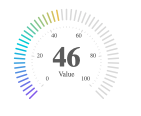<br /><sub>digital</sub>
        </a>
      </td>
      <td align="center">
        <a href="https://wavemaker.github.io/wm-react-native-echarts/?path=/story/charts-gauge-radial--custom-scale" target="_blank">
          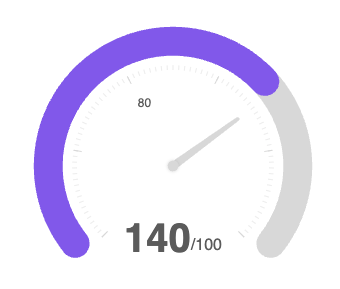<br /><sub>radial</sub>
        </a>
      </td>
      <td align="center">
        <a href="https://wavemaker.github.io/wm-react-native-echarts/?path=/story/charts-gauge-simple--default" target="_blank">
          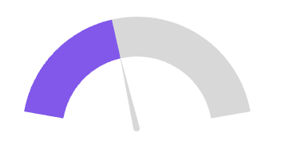<br /><sub>simple</sub>
        </a>
      </td>
    </tr>
  </tbody>
</table>

### Line

<table>
  <tbody>
    <tr>
      <td align="center">
        <a href="https://wavemaker.github.io/wm-react-native-echarts/?path=/story/examples-line--multiple-series" target="_blank">
          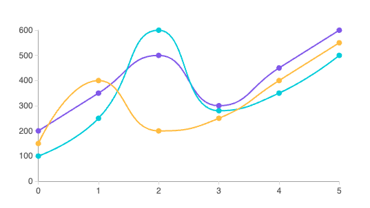<br /><sub>multi-line</sub>
        </a>
      </td>
      <td align="center">
        <a href="https://wavemaker.github.io/wm-react-native-echarts/?path=/story/examples-line--axes-line" target="_blank">
          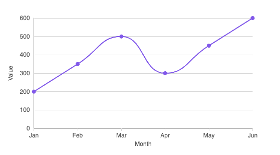<br /><sub>standard-line</sub>
        </a>
      </td>
      <td align="center">
        <a href="https://wavemaker.github.io/wm-react-native-echarts/?path=/story/examples-line--default-line" target="_blank">
          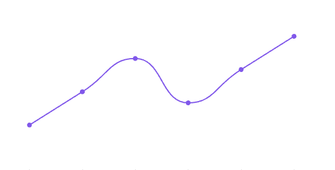<br /><sub>trend-line</sub>
        </a>
      </td>
    </tr>
  </tbody>
</table>

### Pie

<table>
  <tbody>
    <tr>
      <td align="center">
        <a href="https://wavemaker.github.io/wm-react-native-echarts/?path=/story/charts-pie-concentric--two-rings" target="_blank">
          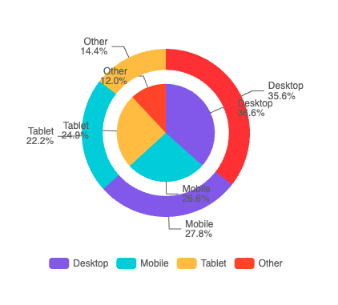<br /><sub>concentric</sub>
        </a>
      </td>
      <td align="center">
        <a href="https://wavemaker.github.io/wm-react-native-echarts/?path=/story/charts-pie-donut--donut" target="_blank">
          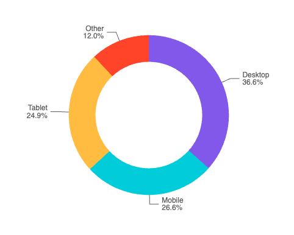<br /><sub>donut</sub>
        </a>
      </td>
      <td align="center">
        <a href="https://wavemaker.github.io/wm-react-native-echarts/?path=/story/charts-pie--default" target="_blank">
          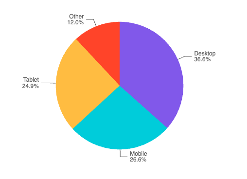<br /><sub>pie</sub>
        </a>
      </td>
    </tr>
  </tbody>
</table>

### Radar

<table>
  <tbody>
    <tr>
      <td align="center">
        <a href="https://wavemaker.github.io/wm-react-native-echarts/?path=/story/charts-radar--default" target="_blank">
          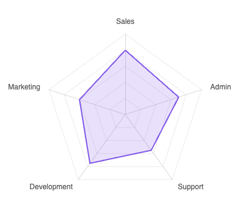<br /><sub>default</sub>
        </a>
      </td>
      <td align="center">
        <a href="https://wavemaker.github.io/wm-react-native-echarts/?path=/story/charts-radar-multiple--default" target="_blank">
          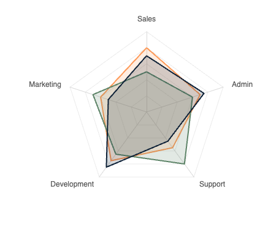<br /><sub>multiple</sub>
        </a>
      </td>
      <td align="center">
        <a href="https://wavemaker.github.io/wm-react-native-echarts/?path=/story/charts-radar-symbol--circle" target="_blank">
          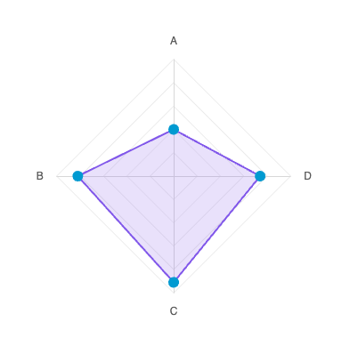<br /><sub>with-symbol</sub>
        </a>
      </td>
    </tr>
  </tbody>
</table>

### Radial

<table>
  <tbody>
    <tr>
      <td align="center">
        <a href="https://wavemaker.github.io/wm-react-native-echarts/?path=/story/charts-radial-colors--custom-colors" target="_blank">
          <br /><sub>custom-colors</sub>
        </a>
      </td>
      <td align="center">
        <a href="https://wavemaker.github.io/wm-react-native-echarts/?path=/story/charts-radial--default" target="_blank">
          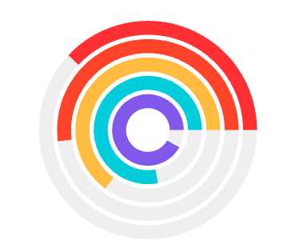<br /><sub>default</sub>
        </a>
      </td>
      <td align="center">
        <a href="https://wavemaker.github.io/wm-react-native-echarts/?path=/story/charts-radial-colors--background" target="_blank">
          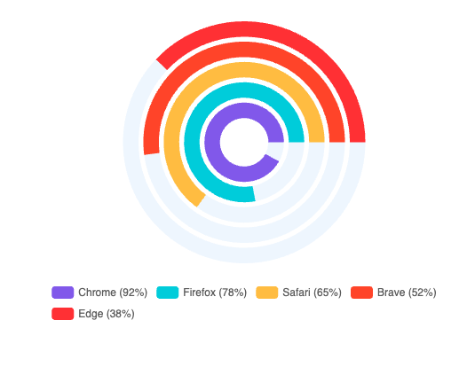<br /><sub>with-bg</sub>
        </a>
      </td>
    </tr>
  </tbody>
</table>

### Scatter

<table>
  <tbody>
    <tr>
      <td align="center">
        <a href="https://wavemaker.github.io/wm-react-native-echarts/?path=/story/charts-scatter--default" target="_blank">
          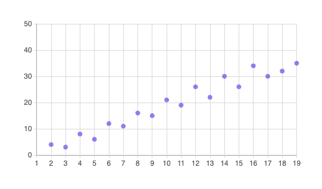<br /><sub>default</sub>
        </a>
      </td>
      <td align="center">
        <a href="https://wavemaker.github.io/wm-react-native-echarts/?path=/story/charts-scatter-colors--multiple-series-colors" target="_blank">
          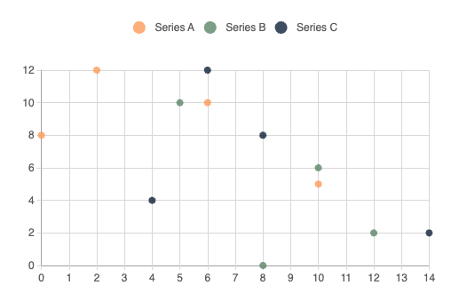<br /><sub>multi</sub>
        </a>
      </td>
      <td align="center">
        <a href="https://wavemaker.github.io/wm-react-native-echarts/?path=/story/charts-scatter-symbol--triangle" target="_blank">
          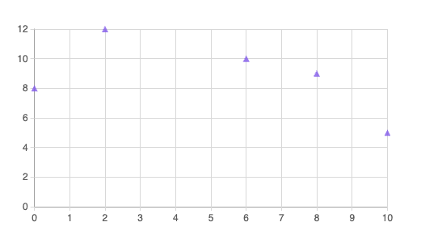<br /><sub>with-symbol</sub>
        </a>
      </td>
    </tr>
  </tbody>
</table>

---

## Building the library (maintainers)

Compile components and prepare the npm package:

```bash
npm run build:lib      # TypeScript compile → dist/npm-packages/charts
npm run prepare:npm    # Write package.json, copy README, .npmignore
cd dist/npm-packages/charts && npm publish
```

---

## Development

Work from the **repository root** (the directory that contains `package.json`, `components/`, and `stories/`).

### Browser (Storybook)

Storybook runs the chart stories in the browser with Vite. After install, it serves at **http://localhost:6006**.

```bash
npm install
npm run storybook
```

### Mobile (Expo sample app)

The **`expo-app/`** project is a small Expo Router app that consumes the library via **[yalc](https://github.com/wclr/yalc)**. Install **`yalc` globally** first so those commands are on your `PATH`.

```bash
npm install -g yalc
cd /path/to/repo # repository root directory
npm install
npm run generate:package
cd expo-app
npm install
npx expo start
```

Whenever you change library source under `components/` or related entry points, run **`npm run generate:package`** again from the repo root so the yalc-linked package is rebuilt and republished. When changes are not reflecting in the app even after reload, use **`npx expo start -c`**.

---

## Maintainers

This package is maintained by [WaveMaker](https://www.wavemaker.com/). The source repository is [wavemaker/wm-react-native-echarts](https://github.com/wavemaker/wm-react-native-echarts). Use [GitHub Issues](https://github.com/wavemaker/wm-react-native-echarts/issues) for bug reports and feature requests.

### Contributors

<table>
  <tbody>
    <tr>
      <td align="center" width="96">
        <a href="https://github.com/sboyina"><br /><sub><b>sboyina</b></sub></a>
      </td>
    </tr>
  </tbody>
</table>


---

## License

MIT
